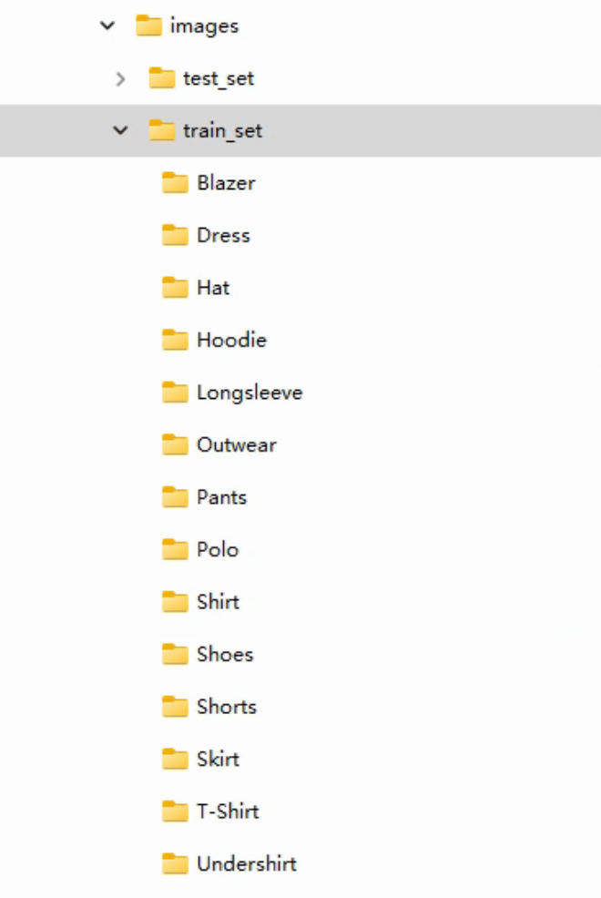
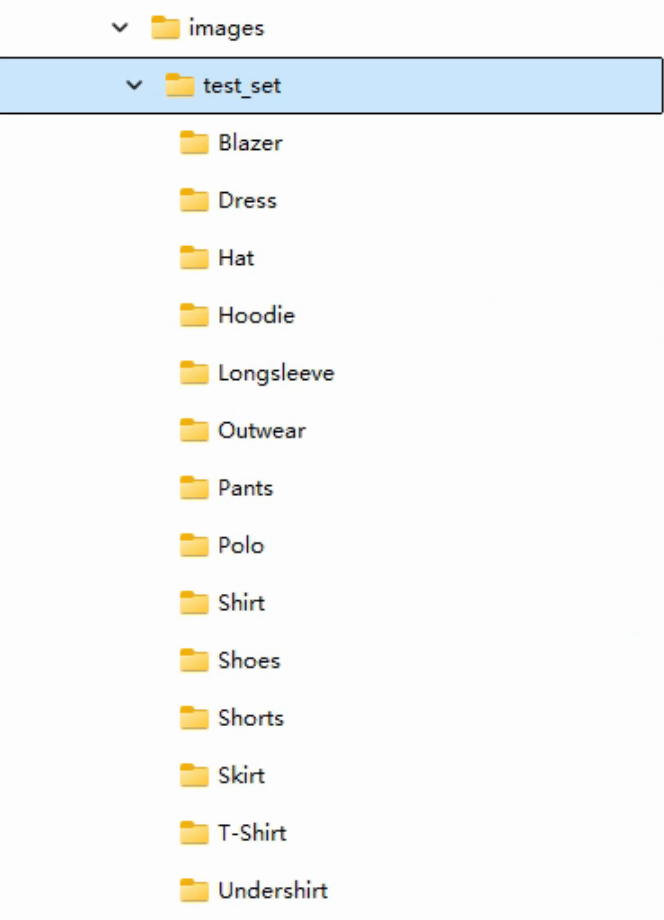

# ImageByFolder : an Simple Image Classifier By Folder

1) Put your train images in the right folder('../data/images/train_set/'), folder name has to be image-class

2) Put your test images in the right folder('../data/images/test_set/'), folder name has to be image-class

3) Update config.py

4) Train

run `python 03_train.py`

5) Test

run `python 04_test.py`